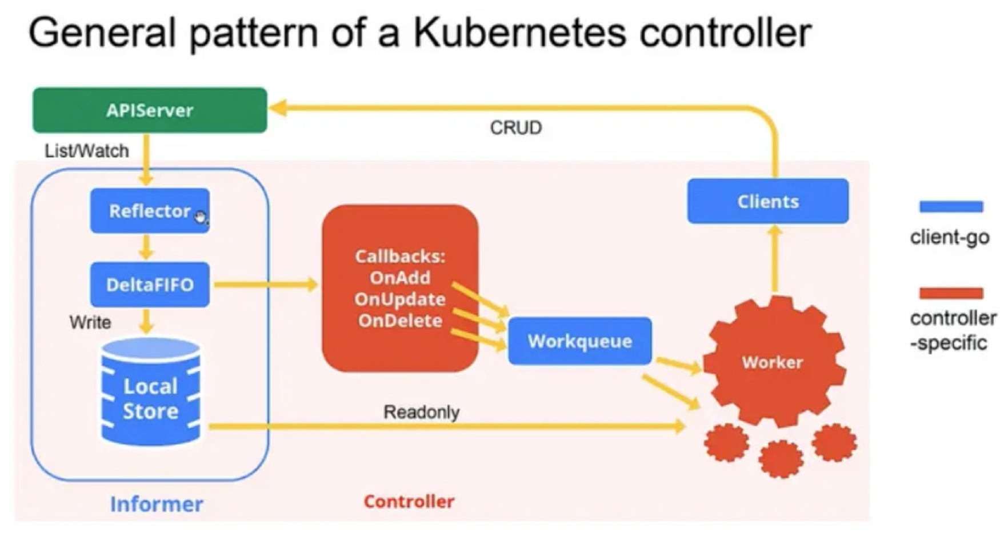
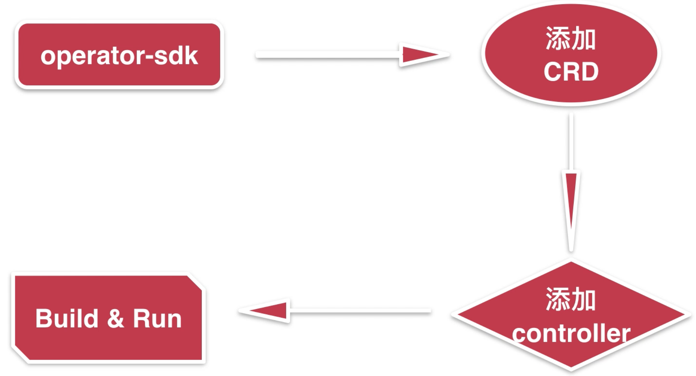

# operator

CRD 自定义k8s资源类型

operator 是一个感知应用状态的控制器，CoreOS推出的旨在简化复杂的，有状态的应用状态的框架；

原理：Operator就是使用CRD实现的定制化的Controller，它与k8s内建的Controller遵循同样的运行模式；



安装operator-sdk: `rew install operator-sdk`

搭建docker registry: `docker run -d -p 5100:5000 --restart always --name registry -v ~/docker-data/docker_registry:/var/lib/registry registry:2`

registry地址： `http://localhost:5100/v2/_catalog`

修改docker配置：

```
 "insecure-registries": [
     "192.168.1.68:5100"
  ],
```

---

section 2



operator sdk quick start

```
operator-sdk new imoocpod-operator --skip-validation=true --repo=github.com/llxxgg/imoocpod-operator

operator-sdk add api --api-version=k8s.imooc.com/v1alpha1 --kind=ImoocPod

operator-sdk add controller --api-version=k8s.imooc.com/v1alpha1 --kind=ImoocPod
```

kubebuilder 快速创建controller的工具。https://github.com/kubernetes-sigs/kubebuilder

官方扩展例子，可以阅读：

https://github.com/kubernetes/sample-apiserver

https://github.com/kubernetes/sample-controller

安装kubebuilder

```
brew install kubebuilder

brew install kustomize
```

client-go与web服务搭建

`cat ~/.kube/config`

informer

client-go

k8s客户端库，还有其他语言的client库。

v1: 正式发布，GA 稳定版本

v1beta1： 预发布

v1alpha1: 试验版本

api对应核心组件

apis 对应非核心组件

GVR 请求路径，Group version resource

GVK: 定义实体资源，


CRD
